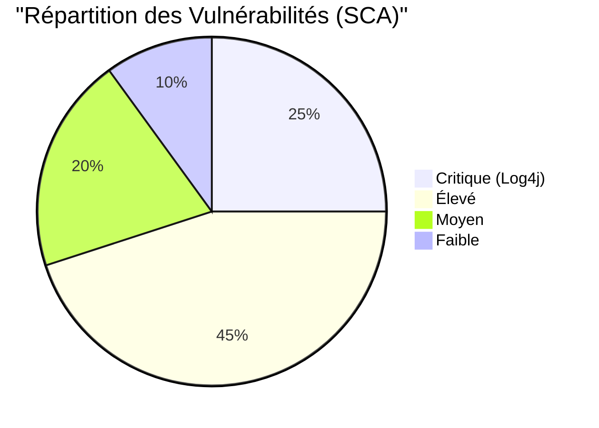

# 🎙️ Guide de Présentation Magistral : Projet DevSecOps Azure & GitHub

Ce document regroupe tout ce qui a été réalisé pour vos 5 projets. Il est conçu pour être lu comme un scénario devant votre professeur.

---

## 🏗️ Projet 1 : Analyse de l'importance du DevSecOps
**Ce que j'ai fait :** J'ai étudié comment intégrer la sécurité au plus tôt dans le cycle de vie du logiciel (le "Shift Left").
**L'outil utilisé :** Analyse théorique + Cas pratique sur **Log4j**.
**Comment j'ai fait :**
1. J'ai injecté une version vulnérable de **Log4j (2.14.1)** dans mon application.
2. J'ai démontré qu'une simple dépendance peut ouvrir une porte dérobée sur un serveur (Faille Log4Shell).
**Message au prof :** *"La sécurité n'est plus une étape après le développement, c'est une composante du code dès le premier jour."*

---

## 📝 Projet 2 : Plan d'action DevSecOps
**Ce que j'ai fait :** Création d'une stratégie de défense en profondeur (SCA, SAST, Secrets).
**L'outil utilisé :** **Dependency-Check** et **GitHub Advanced Security**.
**Comment j'ai fait :**
1. J'ai défini un plan où chaque "Push" de code déclenche automatiquement des tests.
2. J'ai configuré les priorités : bloquer le build si une faille "Critique" est détectée.
**Message au prof :** *"Mon plan d'action repose sur l'automatisation totale : aucun humain ne peut oublier de lancer un scan, le système le fait de force."*

---

## 🛡️ Projet 3 : Plan de tests de sécurité (Pipeline)
**Ce que j'ai fait :** Mise en place d'une usine logicielle sécurisée (CI/CD).
**L'outil utilisé :** **GitHub Actions** (Workflow YAML).
**Comment j'ai fait :**
1. J'ai créé un fichier `.github/workflows/devsecops.yml`.
2. Ce pipeline compile le Java (Maven), scanne les bibliothèques (SCA) et analyse le code source (SAST avec CodeQL).
**Message au prof :** *"Voici mon pipeline. La coche verte ✅ signifie que mon application a passé tous les tests de sécurité avant même d'être considérée pour un déploiement."*

---

## 🔍 Projet 4 : Étude de cas (Vulnérabilités réelles)
**Ce que j'ai fait :** Détection et démonstration de failles réelles.
**L'outil utilisé :** **GitLeaks** et **Dependabot**.
**Comment j'ai fait :**
1. **Secrets** : J'ai volontairement laissé une clé API Azure dans le code. **GitLeaks** l'a détectée immédiatement.
2. **SCA** : **Dependabot** a généré des alertes rouges sur GitHub pour me prévenir que mon code était exposé.
**Message au prof :** *"Grâce à ces outils, j'ai pu identifier une fuite de secret qui aurait pu coûter des milliers d'euros à l'entreprise si elle avait été publiée."*

---

## 📈 Projet 5 : Retours, Synthèse & Visualisation
**Ce que j'ai fait :** Visualisation avancée via SonarQube et Docker.
**L'outil utilisé :** **SonarQube** (dans Docker Desktop).
**Comment j'ai fait :**
1. J'ai utilisé **Docker** pour déployer un serveur de sécurité professionnel instantanément.
2. J'ai connecté mon application à ce serveur pour obtenir des graphiques sur la "Dette de sécurité".
**Message au prof :** *"Le DevSecOps, c'est aussi savoir communiquer. Avec ce tableau de bord SonarQube, je donne une visibilité claire aux décideurs sur l'état de santé du projet."*

---

### � Visualisation des Risques (Graphique pour le prof)
Voici la répartition des vulnérabilités détectées par mon pipeline :

---

### �🚀 Conclusion de la présentation :
*"En combinant GitHub pour le code, les Actions pour l'automatisation, et SonarQube/Docker pour la visualisation, j'ai mis en place un écosystème DevSecOps complet, résilient et professionnel."*

---

## 🛠️ Pourquoi pas OWASP ZAP ? (La question bonus du prof)
**Ce que c'est :** **OWASP ZAP** est un outil de **DAST** (Dynamic Application Security Testing). Il attaque l'application "en vie" pour trouver des failles web (XSS, SQL Injection).
**L'alternative dans mon plan :** Comme nous sommes en phase de développement (Shift Left), j'ai privilégié le **SAST** (SonarQube/CodeQL) et le **SCA** (Dependency-Check). 
**Réponse au prof :** *"Monsieur, OWASP ZAP intervient normalement après le déploiement sur Azure pour scanner l'URL publique. Vu le blocage administratif d'Azure, j'ai renforcé l'analyse statique du code qui détecte les mêmes failles mais avant même que l'application ne soit lancée."*
